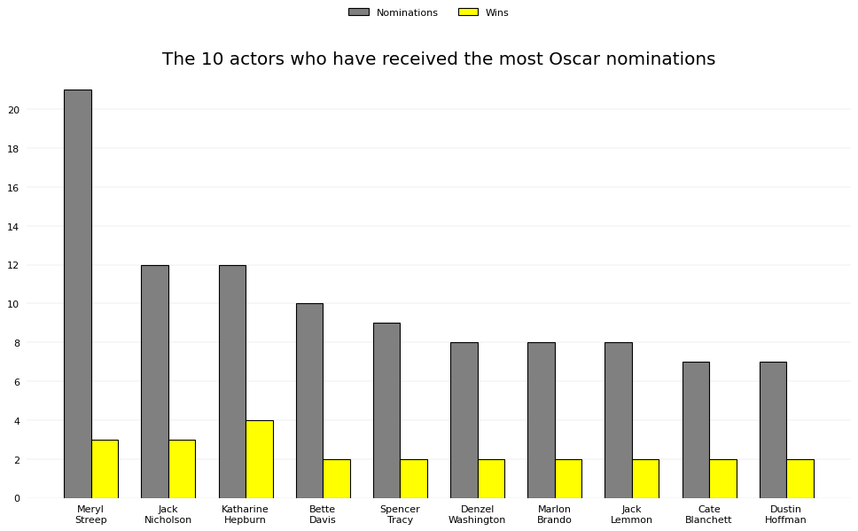
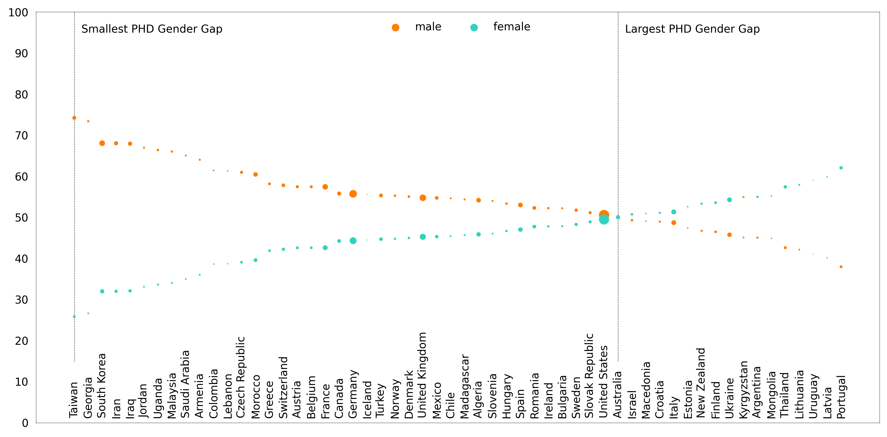
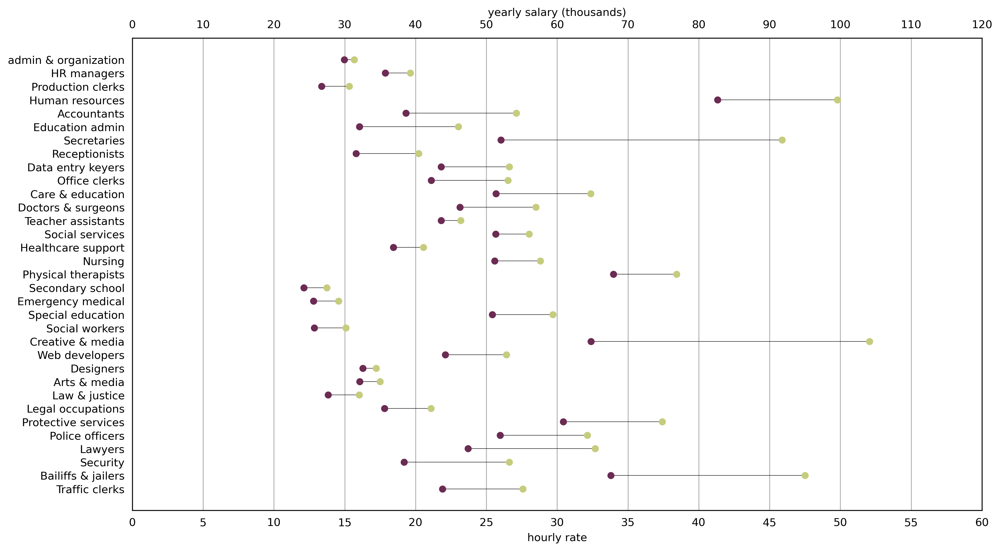
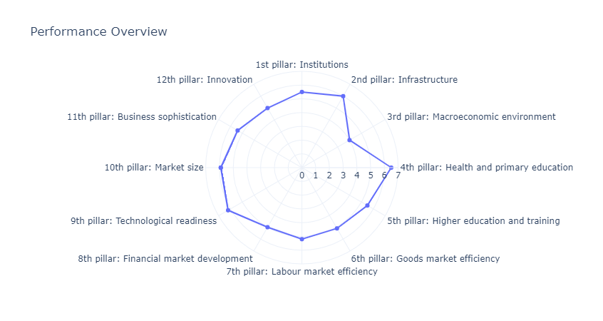
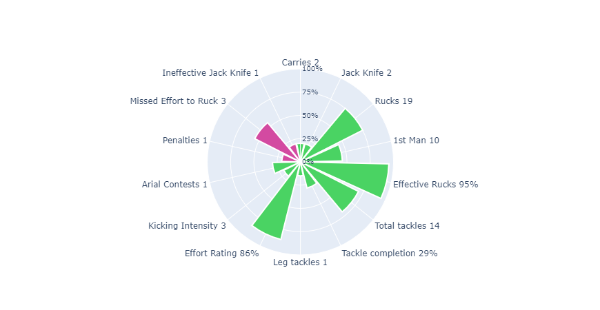
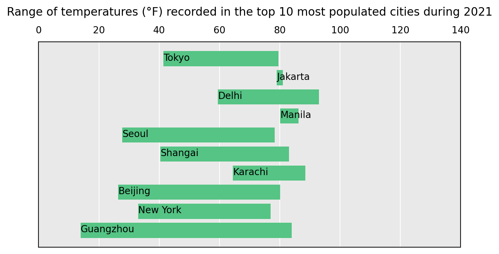
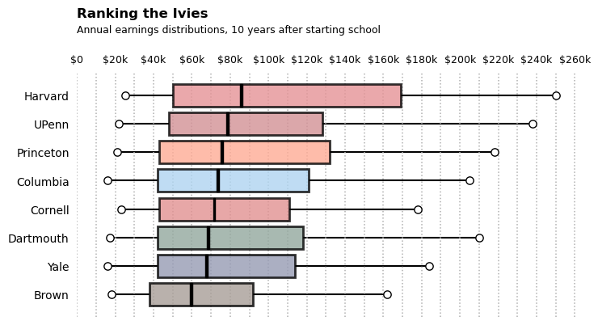

# Content of all The Graphs

- [Bar Chart](#bar-chart)
- [Dot plot](#dot-plot)
- [Connected dot plot](#connected-dot-plot)
- [Pictogram](#pictogram)
- [Bubble chart](#bubble-chart)
- [Radar chart](#radar-chart)
- [Polar chart](#polar-chart)
- [Range chart](#range-chart)
- [Box and Whisker plot](#box-and-whisker-plot)
  
--------

## Bar Chart
column chart

--------

## Dot plot

--------

## Connected dot plot
barbell chart, dumb bell chart

--------

## Pictogram
isotype chart, pictorial bar chart, stacked shape chart, tally chart

--------

## Bubble chart
circle packing diagram

--------

## Radar chart
star chart, spider diagram, web chart

--------

## Polar chart
coxcomb plot, area plot

--------

## Range chart
span chart, floating bar chart, barometer chart

--------

## box-and-whisker plot
boxplot

--------

