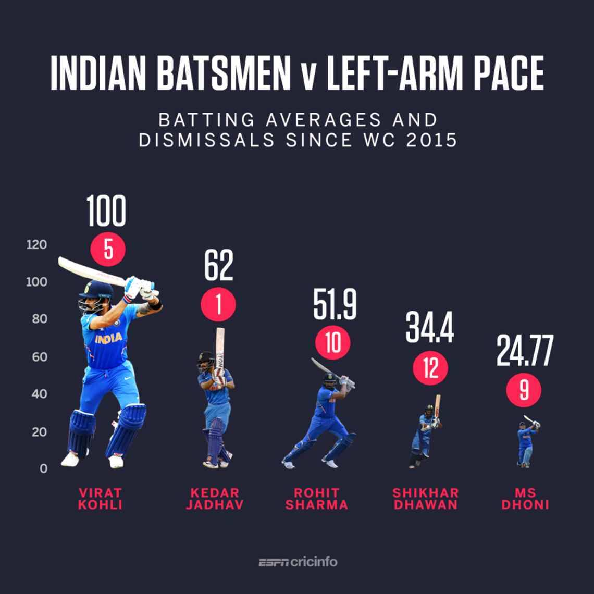
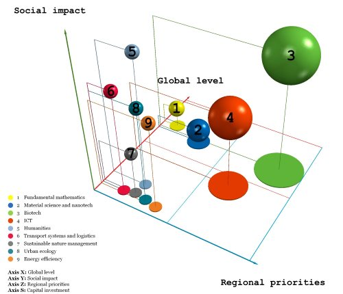
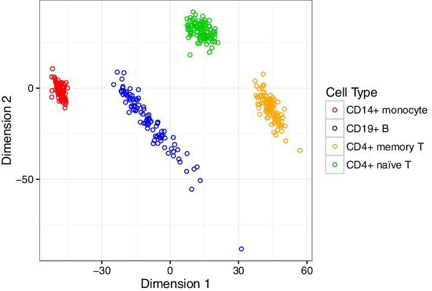

### Question 1
## Describe in detail the meaning of the visual encoding elements in the following infographic reporting data concerning the sleeping time of different individuals. The blue line represents a linear model fitting the data.

A chart is basically made of: visual encoding and chart apparatus. While the second one refers to features specifically related to the type of chart that has been chosen, the visual encoding elements are customized. In this specific case, the chart shows a combination of different graphs: a scatter plot with a line representing the linear model and on the margin the distribution of the sleep hours (upper margin) and hours spent awake on the right margin. 
If then, the visual encoding elements have to be described is important to make a first distinction between **marks** (the symbols, the glyphs) and **annotations** (quantity, size, colour). Generally, the final goal when representing data is finding the right blend of marks and annotations that most effectively portray the desired angle of analysis. 
The **marks** present in this case are:
- *Points*, contained in the scatterplot and representing the quantity via their position in the space.

- *Lines*, that in this case should be differentiated into the blue line, representing the linear model using its steepness and the black lines reporting the density function of the two plots onto the margins. 

**Annotations**, instead, refer to quantity, size, position, and color. Therefore they can be either *quantitative* or *categorical* attributes.  Quantitative attributes present in this graph are: the **position** of points that are mapping the data, the **slope** of the blue line that is showing the result of a linear model with a negative correlation between hours of sleep awake and relative REM sleep. The color are also relevant in this plot because: 
- the confidence intervals (_CI_)of the linear model are highlighted using a different color **lightness** in comparison with the points. Indeed, the CI are depicted using a blurred gray. 
- the colors of the two marginal histograms is also relevant. They have complementary colors such as _green_ and _red_ tones. This choice follows the principles of accessible design. Indeed, even though the audience is undefined, this plot include also individuals with visual impairments (Andy Kirk, Data Visualisation, pg. 273-275). 

A last important remark, following the 5th rule of Tufte (Tufte & Graves-Morris, 1983, The visual display of quantitative information), regards the use of annotations within a chart. In this case annotations are not present. The only exceptions are the axes titles, which are in bold, readable and informative guides (they report the metric chosen, i.e. hours) and the axes labels. 

### Question 2
## Discuss in detail the issue of chartjunks in infographics as opposed to useful decorations, and present two examples, different from those shown in the course slides.

The minimalism of Tufte applied on data visualization is based on several rules exposed by Tufte & Graves-Morris (1983) in the book **The visual display of quantitative information**. These rules can be interpreted as "tips" when developing a chart. A relevant remark must be done when speaking about chartjunks, which are charts showing too many decorative elements. These elements are futile because they do not rescue a thin or limited data set (Tufte), but they also be dangerous because they might deceive the user. Moreover. chartjunks do not follow the _Principles of good design_ of D. Rams, which can be exploited in 3 areas. Specifically, data visualization must be:

-	TRUSTWORTHY. Even though the objectivity cannot be reach, data must show the truth and pursue trustworthiness in processing, representing and presenting stages. Hence, the receiver must not be detracted from the actual message and any misunderstanding, inaccuracy, confusion, and distortion should be avoided.

-	ACCESSIBLE, meaning that a minimum friction should be experienced by the viewer between the act of understanding (effort) and its achievement (reward).

-	ELEGANT. The objective should be a visually qualitative result that attracts the target audience and has a style that does not overcome the substance.  

The Fig.1 may be a good example of chartjunk. Firstly, the values reported on the y-axis are inconsistent with respect to player height (which should correspond to the white number). Another unclear data is represented in the red circles. Moreover, using the players images to represent these thiny dataset does not help the viewer. Even though it may be perceived as qualitative pleasant, the decorations, in my opinion, overcome the actual message and may also create confusion (e.g. the numbers in red circles and the white numbers). 




The FIg.2 is another example of chartjunks, showing an innappropriate use of the 3D. Indeed, the developer introduces a third dimension (_S-Axis_) to enhance the scatter plot below. Trying to understand this chart may require a lot effort from the user, who should interpret almost 4 dimensions. Thus, the spheres have also a volume. It is also difficult to understand if a sphere is larger because closer to the viewer on the Z-axis or if it is just larger, corresponding the S-axis. Also the projections should help, but in this case they are generating a chaotic and colorful interweaving.   



### Question 3
## Describe the different versions of MDS (classical, metric, non-metric) and provide some examples different from those shown in the course slides.

Multidimensional scaling is a family of algorithms included in the approaches ofdimensionality reduction for linear cases (along with PCA). Specifically, these algorithms visualize the level of similarity of individual cases of a data set finding an embedding of *n* objects into a *r*-dimensional Euclidean space $R^n$. Thus, they try to preserve as well as possible (a function of) the distances between the points in the original space.

The MDS method differ from PCA (Principal component analysis) because it employs distances between points, while PCA relies on the angles between vectors.

MDS can be employed following 3 different versions. They differ in terms of objective function chosen to map the input space into a lower embedding.The versions are the following:

- **Classical MDS**: the objective function is called _strain_ and directly involves the original distances between data points. The final solution is deterministic and the core of the dimensionality reduction process follows the PCA procedure.Generally, if there exists a lower space $R^p$ where all the original distances between points are preserved, the distance $d$ is the Euclidean distance. 

- **Metric MDS**: the relative objective function is called _stress_. It transform the original distances between points involving a specific function.

- **Non-metric MDS**: the distances in the input space are dissimilarities. Thus, the _stress_ function defines a non-parametric monotonic relationship between the dissimilarities in the object-object and the Euclidean distance between objects. In this way the location of each object is defined. 


In the last two cases, metric and not metric, the process follows an optimization proble and depends on $d$, distance, being quantitative or not. 

MDS algorithms may be implemented in other area of research, such as in marketing research and product planning (Cooper LG. A Review of Multidimensional Scaling in Marketing Research. Applied Psychological Measurement. 1983;7(4):427-450.), or, as the fig.3 shows, in DNA methylation profiles. In this chart, the MDS plot of 371 samples shows that samples cluster according to cell type (Rhead, B., Holingue, C., et al., Rheumatoid Arthritis Naive T Cells Share Hypermethylation Sites With Synoviocytes. Arthritis & Rheumatology, 2016). 



### Question 4
The datafile socioeconomy_time_series.csv collects 4 indicators (inflation rate, unemployment rate, health expenditure rate as GDP percentage and public education expenditure rate as GDP percentage) for a number of countries in the time span 1960-2018. Using this data or a subset of, (e.g., only the European countries) prepare a data visualization including

- at least two choropleth maps showing the dynamics of one or more indicators in different years 

- a (non-geographic) statistical chart of your choice


```{r}
library(dplyr)
library(geojsonio)

df_socio <- read_csv("socioeconomy_time_series.csv")
df_socio <- na.omit(df_socio)
anyNA(df_socio)

# filtering rows 
row_to_keep <- c(
  "Italy", "Austria", "Norway", "Latvia", "Lithuania", "Belarus", "Ukraine",  "Sweden", "Turkey",
  "Poland", "Moldova", "Romania", "Estonia", "Finland", "Slovakia", "Portugal", "Hungary", "Czech Republic (Czechia)", "Germany", "Denmark", "Serbia", "Bulgaria", "Greece", "Albania", "Iceland", "France", "Spain", "United Kingdom", "Ireland", "Netherlands", "Switzerland", "Russia")

time_to_keep <- c(1960, 1970, 1980, 1990, 2000, 2010)

df_socio <- df_socio%>%filter(country %in% row_to_keep)%>%filter(year %in% time_to_keep)

df_socio$year <- as.factor(df_socio$year)

# Get the data of all world countries
spdf <- geojson_read("countries.geojson",  what = "sp")

# Fortify data
spdf_fortified <- tidy(spdf, region = "ADMIN")

# Join the data 
spdf_fortified <-  spdf_fortified %>%
  right_join(. , df_socio, by=c("id"="country"))

head(spdf_fortified)


```

```{r}

ggplot()+geom_polygon(data = spdf_fortified, aes(fill = inflation, x = long, y = lat, group = factor(group)))+facet_wrap(~ year)+
  theme_void() +
  coord_map()

```

```{r}


ggplot()+geom_polygon(data = spdf_fortified, aes(fill = unemployment, x = long, y = lat, group = factor(group)))+facet_wrap(~ year)+
  theme_void() +
  coord_map()+
  scale_fill_gradient2(midpoint = 10, 
                       low = "#306A38", 
                       mid = "#F9F414", 
                       high = "#FF0000")

```


```{r}

df_socio <- read_csv("socioeconomy_time_series.csv")
df_socio <- na.omit(df_socio)
anyNA(df_socio)

# filtering rows 
row_to_keep <- c(
  "Italy","Germany")


df_socio <- df_socio%>%filter(country %in% row_to_keep)

df_socio$country <- as.factor(df_socio$country)

x_break <- c(seq(1980,2010, 10), 2016)
x_lab <- as.character(x_break)

ggplot(data = df_socio, aes(x=year, y = unemployment)) + geom_point(col="steelblue", size=1) + geom_line(col = "tomato3")+
  theme_bw() +facet_wrap(~country)+
    labs(title = "Unemployment rate, comparing Germany and Italy",
         subtitle = " Period 1980 - 2016",
    x="Year", 
    y="Unemployment rate (%)")+ 
  scale_x_continuous(breaks=x_break, labels =x_lab, limits = c(1980, 2017))
  


```


### Question 5

Consider the datafile Colposcopies.csv collecting data about quality assessment of digital colposcopies for 287 individuals. Every colposcopy is described by 62 variables, while the last column ("label") classifies the colposcopy as of good (1) or bad (0) quality. Using the 62 describing features, prepare a 2-dim tSNE and a 2-dim UMAP plot, with the 287 samples colored according to their label and discuss what dimensionality reduction algorithm provides better separation between the two different classes of samples (0 and 1). 

The answer is in the notebook: Lucia_Hrovatin.ipynb

### Question 6

```{r}

library(ggplot2)
library(readr)
library(tidyr)
library(tibble)
library(hrbrthemes)
library(dplyr)
library(scales)

df_heat <- read_csv("heatmap.csv")

y_break <- seq(2001, 2015)
y_lab <- as.character(y_break)
x_break <- seq(1,7)
x_lab <- as.character(x_break)


ggplot(df_heat, aes(x=`Elevation Zone`, y= Year, fill=Value)) + 
  geom_raster(interpolate = TRUE) + 
  coord_fixed(ylim=c(2001, 2015), expand = FALSE)+
  scale_y_continuous(breaks=y_break,labels=y_lab)+
  scale_x_continuous(breaks=x_break, labels =x_lab)+
  theme(panel.background = element_blank(),
        panel.border = element_rect(colour = "black", fill=NA, size=0.3),
        legend.title = element_blank(), 
        axis.text.x = element_text(face="bold", colour = "black"), 
        axis.text.y = element_text(face="bold", colour = "black"), 
        axis.title.x= element_text(face="bold", colour = "black"),
        axis.title.y= element_text(face="bold", colour = "black"))+
  scale_fill_gradient2(midpoint = 140, 
                       low = "#306A38", 
                       mid = "#F9F414", 
                       high = "#FF0000", 
                       limits = c(110, 170))
  
  
 


```


